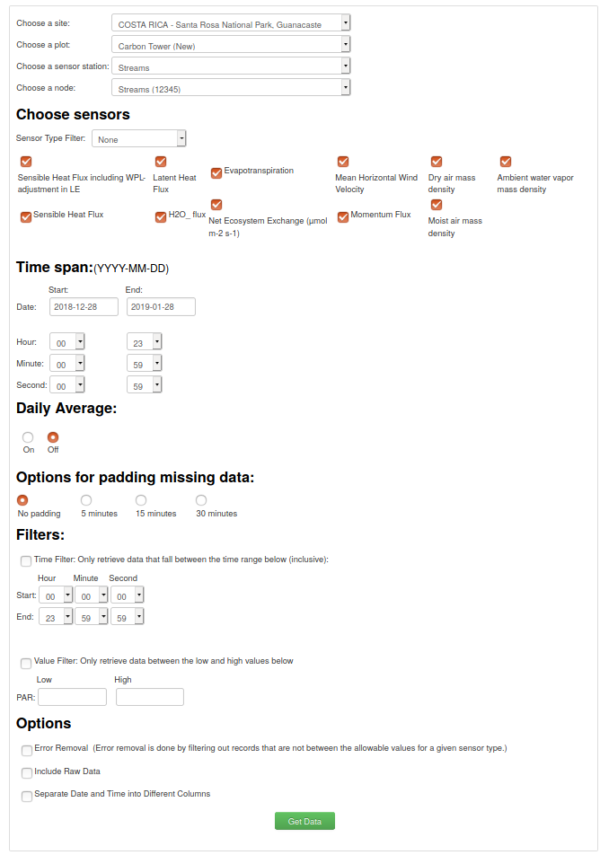
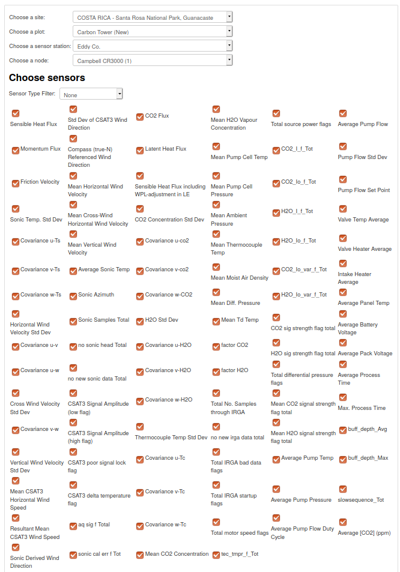

```{r setup, include=FALSE}
knitr::opts_chunk$set(echo = TRUE)
library(readr)
library(dplyr)
library(purrr)
library(tidyr)
library(gt)
library(janitor)

# Import data
carbon_tower_streams <- read_csv("data/COSTARICA-SantaRosaNationalPark,Guanacaste_CarbonTower(New)_Streams_Streams(12345)_20181228_20190128.csv") %>% 
  clean_names()

carbon_tower_eddy <- read_csv("data/COSTARICA-SantaRosaNationalPark,Guanacaste_CarbonTower(New)_EddyCo._CampbellCR3000(1)_20130607_20190512.csv") %>% 
  clean_names()
```

# 
```{r, message=FALSE}
create_dictionary <- function(data) {
  
  # Obtain types
  types <- map_dfr(.x = data, .f = function(tipo) {
    typeof(tipo)
  }) %>% 
    pivot_longer(cols = everything(), 
                 names_to = "variable",
                 values_to = "type")
  
  # Obtain total missing data per variable
  missing <- map_dfr(.x = data, .f = function(missing) {
    is.na(missing) %>% 
      sum() %>% 
      format(., big.mark = ",")
  }) %>% 
    pivot_longer(cols = everything(), 
                 names_to = "variable",
                 values_to = "missing")
  
  # Obtain total different values per variable
  diff <- map_dfr(.x = data, .f = function(missing) {
    n_distinct(missing)
  }) %>% 
    pivot_longer(cols = everything(), 
                 names_to = "variable", 
                 values_to = "unique")
  
  # Unite new variables
  dictionary <- left_join(types, missing) %>% 
    left_join(diff)
  
  return(dictionary)
}
```

# Carbon tower data streams

For this data, we use the enviro-net portal and we selected the options showed
in the image below:

<br>

</br>

```{r, message=FALSE}
create_dictionary(carbon_tower_streams) %>% 
  gt()
```

# Carbon tower data eddy covariance

For this data, we use the enviro-net portal and we selected the options showed
in the image below:

<br>


</br>

```{r, message=FALSE}
create_dictionary(carbon_tower_eddy) %>% 
  gt()
```
