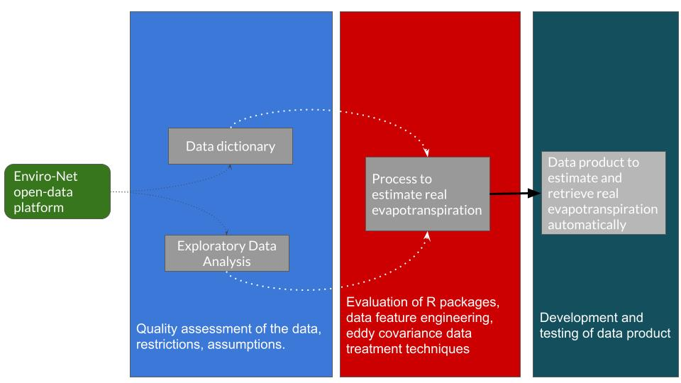

```{r setup, include=FALSE}
knitr::opts_chunk$set(echo = TRUE, message = FALSE, warning = FALSE)
library(dplyr)
library(ggplot2)
library(readr)
library(janitor)
library(visdat)
library(bigleaf)
library(lubridate)
library(gt)
library(tidyr)
library(purrr)
library(rmdformats)
library(skimr)
library(stringr)
library(corrplot)

# Number output options
options(scipen = 20)
options(Sys.getlocale("LC_CTYPE"))
```

# Workflow

Using eddy covariance open-data from Enviro-Net platform and the R
programming language to estimate real evapotranspiration in the tropical
dry forest




# Import data

We are going to import three datasets that comes from the Enviro-Net open-data
platform. This data sets are:

 - carbon_tower_streams: Data from the Carbon Tower that it's from the streams
 sensor station
 - carbon_tower_eddy: Data from the Carbon Tower that it's from the Eddy Co.
 sensor station
 - principe_tower_eddy: Data from the Principe Tower that it's from the Eddy Co.
 sensor station
```{r}
carbon_tower_streams <- read_csv("data/COSTARICA-SantaRosaNationalPark,Guanacaste_CarbonTower(New)_Streams_Streams(12345)_20181228_20190128.csv") %>% 
  clean_names()

carbon_tower_eddy <- read_csv("data/COSTARICA-SantaRosaNationalPark,Guanacaste_CarbonTower(New)_EddyCo._CampbellCR3000(1)_20130607_20190512.csv") %>% 
  clean_names()

principe_tower_eddy <- read_csv("data/COSTARICA-SantaRosaNationalPark,Guanacaste_PrincipeTower(New)_EddyCo._CampbellCR3000(2)_20151213_20190622.csv") %>% 
  clean_names()
```

**Notes on datasets**
 
  - All datapoints are on 30 min intervals

# carbon_tower_streams EDA

In order to understand the structure of the data set please check the
**DICTIONARY file**

**Note** Even if you select a date range from 2013 to present in the 
enviro-net portal, there are just two months available to retrieve.

## Evapotranspiration EDA from streams

First we check the months and years available in the data set: 
```{r}
carbon_tower_streams %>% 
  mutate(date = as_date(date_time)) %>% 
  group_by(year(date), month(date)) %>% 
  tally() %>% 
  ungroup() %>% 
  rename("Year" = `year(date)`,
         "Month" = `month(date)`,
         "Total observations" = "n") %>% 
  gt() %>% 
  tab_header(
    title = md("**Total observations per date**"),
    subtitle = ("For the carbon tower data streams")
  ) 
```

<br> 
The date range we have available is `r range(carbon_tower_streams$date_time, na.rm = TRUE)`,
that's just one month.

```{r}
# Evapotranspiration
carbon_tower_streams %>% 
  mutate(date = ymd_hms(date_time)) %>%
  ggplot(aes(x = date_time, y = evapotranspiration)) +
  geom_point() +
  # Si tenemos datetime, cambiamos el scale_x
  scale_x_datetime(date_labels = "%d-%b-%Y",  date_breaks = "1 day") +
  theme_light(base_size = 16) +
  theme(axis.text.x = element_text(angle = 90)) +
  labs(title = "Evapotranspiration from the Carbon tower in Santa Rosa",
       subtitle = "Data from the streams sensor station that includes the
       evapotranspiration calculation",
       x = "Date", y = "Evapotranspiration kg m-2 s-1")

# day <- interval(hms("06:00:00"), hms("17:30:00"))
# carbon_tower_streams %>%
#   mutate(day = ifelse(hms(date_time) > hms("06:00:00") & 
#                         hms(date_time) > hms("17:00:00"), 
#                       "dia", "noche")) %>%
#   select(date_time, day) %>%  View()
```

```{r}
carbon_tower_streams %>% 
  separate(col = date_time, into = c("date", "time"), sep = " ") %>% 
  mutate(time = hms(time),
         day = ifelse(hms(time) > hms("05:20:00") & 
                        hms(time) < hms("17:20:00"),
                      "day", "nigth")) %>%
  replace_na(list(day = "nigth")) %>% 
  ggplot(aes(x = date, y = evapotranspiration, colour = day)) +
  geom_jitter(alpha = 0.5, size = 2) +
  theme_light(base_size = 12) +
  theme(axis.text.x = element_text(angle = 75, h = 1)) +
  scale_y_continuous(breaks = seq(-0.2, 0.2, by = 0.02)) +
  labs(title = "Evapotranspiration carbon tower Santa Rosa",
       subtitle = "Day defined as the interval of date time from 05:20:00 to 17:20:00",
       x = "Date", 
       y = "Evapotranspiration kg m-2 s-1",
       fill = "Day period")
```

There are some values with high latent_heat_flux and thus high evapotranspiration
values in the night. **Is this normal or is due to an error?**

I defined day as those observations between the `date_time > 05:20:00` and 
`date_time 17:20:00` in order to check this values
```{r check night values, eval = FALSE, fig.width=10}
# Check nigth values with evapotranspiration close to day values
## above 0.04 we can try to explore those values in the nigth category
carbon_tower_streams %>% 
  separate(col = date_time, into = c("date", "time"), sep = " ") %>% 
  mutate(time = hms(time),
         day = ifelse(hms(time) > hms("05:20:00") & 
                        hms(time) < hms("17:20:00"),
                      "day", "nigth")) %>%
  # This replace is due to the 00:00 time format
  replace_na(list(day = "nigth")) %>% 
  filter(evapotranspiration > 0.04) %>% 
  DT::datatable(
    rownames = FALSE,
    extensions = 'Buttons',
    selection = list(mode = 'single', target = 'row'),
    options = list(
      lengthMenu = list(c(20, 50, 100, -1), c('20', '50', '100', 'All')),
      dom = 'Bflp',
      buttons = c('copy', 'csv', 'excel', 'pdf', 'print'),
      scrollX = T)) 
```


```{r}
# Revisión de datos de evapotranspiracion y latent heat
check <- carbon_tower_streams %>% 
  separate(col = date_time, into = c("date", "time"), sep = " ") %>% 
  mutate(time = hms(time),
         day = ifelse(hms(time) > hms("05:20:00") & 
                        hms(time) < hms("17:20:00"),
                      "day", "nigth")) %>%
  replace_na(list(day = "nigth")) %>% 
  mutate(eva_plus = ifelse(evapotranspiration > 0.04, "high", "low"))

# ¿Qué características tienen los puntos de noche con eva > 0.04?
check %>% 
  select(time, day, evapotranspiration, latent_heat_flux) %>% 
  filter(evapotranspiration > 0.04, day == "nigth") %>% 
  arrange(desc(evapotranspiration)) %>% 
  head(15) %>% 
  gt() %>% 
  tab_header(
    title = "High  evapotranspiration values during nigth",
    subtitle = "For the carbon tower data streams"
  )
# Notar que el latent heat flux es la multiplicacion de
# evapotranspiracion * mil

# check %>% 
#   # filter(eva_plus == "high") %>% 
#   ggplot(aes(x = evapotranspiration, y = latent_heat_flux, colour = day)) +
#   geom_jitter(alpha = 0.3, size = 2) +
#   theme_light()
```

## Exploration of other variables behaviour trough dates availables

This are some plots to explore and understand the behaviour of other variables
in the dataset `carbon_tower_streams` trough time.
```{r}
# Water vapor mass density carbon
carbon_tower_streams %>% 
  mutate(date = ymd_hms(date_time)) %>%
  ggplot(aes(x = date_time, y = ambient_water_vapor_mass_density)) +
  geom_line() +
  # Si tenemos datetime, cambiamos el scale_x
  scale_x_datetime(date_labels = "%d-%b-%Y",  date_breaks = "1 day") +
  theme_light(base_size = 16) +
  theme(axis.text.x = element_text(angle = 90)) +
  labs(title = "Water vapor mass density carbon tower Santa Rosa",
       x = "Date", y = "Water vapor mass density kg m-3")
```


```{r}
# Latent heat flux
carbon_tower_streams %>% 
  mutate(date = ymd_hms(date_time)) %>%
  ggplot(aes(x = date_time, y = latent_heat_flux)) +
  geom_line() +
  # Si tenemos datetime, cambiamos el scale_x
  scale_x_datetime(date_labels = "%d-%b-%Y",  date_breaks = "1 day") +
  theme_light(base_size = 16) +
  theme(axis.text.x = element_text(angle = 90)) +
  labs(title = "Latent heat flux carbon tower Santa Rosa",
       x = "Date", y = "Latent heat flux W m-2")
```


```{r}
# Net ecosystem exchange
carbon_tower_streams %>% 
  mutate(date = ymd_hms(date_time)) %>%
  ggplot(aes(x = date_time, y = net_ecosystem_exchange_mmol_m_2_s_1 )) +
  geom_line() +
  # Si tenemos datetime, cambiamos el scale_x
  scale_x_datetime(date_labels = "%d-%b-%Y",  date_breaks = "1 day") +
  theme_light(base_size = 16) +
  theme(axis.text.x = element_text(angle = 90)) +
  labs(title = "Net ecosystem exchange carbon tower Santa Rosa",
       x = "Date", y = "Net ecosystem exchange mmol m2 s1")
```

## Relations between variables

Just to understand evapotranspiration behaviour against other variables
```{r}
carbon_tower_streams %>% 
  mutate(date = ymd_hms(date_time)) %>%
  ggplot(aes(y = evapotranspiration, 
             x = net_ecosystem_exchange_mmol_m_2_s_1 )) +
  geom_point() +
  geom_smooth(method = "lm") +
  theme_light(base_size = 16)

carbon_tower_streams %>% 
  mutate(date = ymd_hms(date_time)) %>%
  ggplot(aes(y = evapotranspiration, 
             x = latent_heat_flux)) +
  geom_point() +
  geom_smooth(method = "lm") +
  theme_light(base_size = 16)

carbon_tower_streams %>% 
  mutate(date = ymd_hms(date_time)) %>%
  ggplot(aes(y = evapotranspiration, 
             x = ambient_water_vapor_mass_density)) +
  geom_point() +
  geom_smooth(method = "lm") +
  theme_light(base_size = 16)
```

```{r, echo = FALSE}
# carbon_tower_streams %>% 
#   separate(col = date_time, into = c("date", "time"), sep = " ") %>% 
#   mutate(day_nigth = ifelse()) %>%
```

# carbon_tower_eddy EDA

In order to understand the structure of the data set please check the
**DICTIONARY file**

**Note** 

```{r}
# Select variables to play with
eddy <- carbon_tower_eddy %>% 
  select(date_time, sensible_heat_flux, co2_flux, latent_heat_flux,
         mean_co2_concentration, mean_h2o_vapour_concentration, 
         mean_moist_air_density, mean_thermocouple_temp)

# Check available dates in the data set
eddy %>% 
  group_by(year(date_time), month(date_time, 
                                  label = TRUE,
                                  locale = Sys.getlocale("LC_CTYPE"))) %>% 
  tally() %>% 
  rename(
    Year = `year(date_time)`,
    Month = `month(date_time, label = TRUE, locale = Sys.getlocale("LC_CTYPE"))`,
    Observations = "n"
  ) %>% 
  gt() %>% 
  tab_header(
    title = md("**Total of observations per year and month**"),
    subtitle = ("For the carbon tower eddy data")
  ) %>% 
  fmt_number(columns = vars(Observations),
             decimals = 0,
             use_seps = TRUE) %>% 
  data_color(
    columns = vars(Month),
    colors = scales::col_factor("Spectral", domain = NULL)
  )

# Por mes agregado por año
eddy %>% 
  group_by(year(date_time), month(date_time)) %>% 
  tally() %>% 
  ggplot(aes(x = as.factor(`month(date_time)`),
             y = n, 
             fill = as.factor(`year(date_time)`))) +
  geom_bar(stat = "identity") +
  scale_fill_viridis_d() +
  labs(x = "Month", y = "Total observations", fill = "Year") +
  theme_light(base_size = 16)

# Separados por mes y por año
eddy %>% 
  group_by(zoo::as.yearmon(date_time)) %>% 
  tally() %>% 
  rename("date" = `zoo::as.yearmon(date_time)`, "total" = "n") %>% 
  ggplot(aes(x = as.factor(date),
             y = total, 
             fill = as.factor(year(date)))) +
  geom_bar(stat = "identity") +
  scale_fill_viridis_d() +
  labs(x = "Month", y = "Total observations", fill = "Year") +
  theme_light(base_size = 21) +
  theme(axis.text.x = element_text(angle = 70, h = 1))
```

## Evapotranspiracion calculation with bigleafR

<!-- For bigleafR function we need latent heat and air temperature with -->
<!-- LE of 200 Wm-2 and air temperature of 25degC `LE.to.ET(200, 25)` -->

We can obtain evapotranspiration with the `bigleafR` function, in which we
can use Latent Heat Flux (W m-2) with Air Temperature (C) to obtain
evapotranspiracion (kg m-2 s-1)
```{r}
evapotranspiration <- eddy %>% 
  mutate(evapotranspiration_kg = LE.to.ET(latent_heat_flux,
                                          mean_thermocouple_temp)) %>% 
  # Transform units
  mutate(evapotranspiration_mol = kg.to.mol((evapotranspiration_kg) * 1000))
```

With the dataset `carbon_tomer_streams` we saw that there is a strong
correlation between `latent_heat_flux` and `evapotranspiration` and it's
basically `latent_heat_flux * 1000`. I want to check if this is the same
with the results obtained using the bigleafR package:
```{r}
evapotranspiration %>% 
  select(latent_heat_flux, evapotranspiration_kg) %>% 
  head(20) %>% 
  gt() %>% 
  tab_header(
    title = md("**Comparison of Latent Heat Flux with Evapotranspiration**"),
    subtitle = "For the Carbon Tower eddy data"
  ) %>% 
  tab_footnote(
     footnote = "Shows only the first 20 observations",
     locations = cells_column_labels(
       columns = vars(latent_heat_flux, evapotranspiration_kg)
     )
  )
```

## Exploratory visualizations from eddy

 - Plot with all the evapotranspiration data points from 2013 to 2019
 - There is no data for 2018 and only 3 months for 2019
```{r}
evapotranspiration %>% 
  mutate(date = ymd_hms(date_time)) %>%
  # filter values above 0.05
  filter(evapotranspiration_mol < 1000 & evapotranspiration_mol > -500) %>%
  # filter(year(date_time) == 2013) %>% 
  ggplot(aes(x = date_time, y = evapotranspiration_mol)) +
  geom_point(alpha = 0.5) +
  scale_x_datetime(date_labels = "%b", breaks = "months") +
  theme_light(base_size = 21) +
  theme(axis.text.x = element_text(angle = 75, h = 1)) +
  labs(title = "Evapotranspiration carbon tower Santa Rosa",
       subtitle = "Al the datapoints available",
       x = "Date", y = "Evapotranspiration mmol m-2 s-1")
```

```{r}
plot_evapotranspiration <- function(data, year) {
  data %>%
    mutate(date = ymd_hms(date_time),
           year = year(date_time)) %>%
    # filter values above 0.05
    # filter(evapotranspiration < 0.02 & evapotranspiration > -0.02) %>%
    filter(year == !!year) %>%
    ggplot(aes(x = date_time, y = evapotranspiration_mol)) +
    geom_point(alpha = 0.5) +
    # geom_line() +
    scale_x_datetime(date_labels = "%b", breaks = "months") +
    theme_light(base_size = 16) +
    theme(axis.text.x = element_text(angle = 75, h = 1)) +
    labs(title = "Evapotranspiration carbon tower Santa Rosa",
         subtitle = paste("With all the datapoints available for", year),
         x = "Date", y = "Evapotranspiration mmol m-2 s-1")
}

## Get years
years <- evapotranspiration %>% 
  transmute(year = year(date_time)) %>% 
  distinct() %>% 
  pull()

# Map to get all plots
map(.x = years, .f = function(plots) {
  evapotranspiration %>% 
    plot_evapotranspiration(year = plots)
})
```

# principe_tower_eddy EDA

In order to understand the structure of the data set please check the
**DICTIONARY file**

**Note** The data available in enviro-net from this tower does not contains
`stream data`. But it does have the variable `air_temperature`

```{r}
# Select variables to play with
eddy <- principe_tower_eddy %>% 
  select(date_time, sensible_heat_flux, co2_flux, latent_heat_flux,
         mean_co2_concentration, mean_h2o_vapour_concentration, 
         mean_moist_air_density, mean_thermocouple_temp,
         air_temperature, humidity, saturation_vapour_pressure_k_pa)

# Check available dates in the data set
eddy %>% 
  group_by(year(date_time), month(date_time, 
                                  label = TRUE,
                                  locale = Sys.getlocale("LC_CTYPE"))) %>% 
  tally() %>% 
  rename(
    Year = `year(date_time)`,
    Month = `month(date_time, label = TRUE, locale = Sys.getlocale("LC_CTYPE"))`,
    Observations = "n"
  ) %>% 
  gt() %>% 
  tab_header(
    title = md("**Total of observations per year and month**"),
    subtitle = ("For the Principe tower eddy data")
  ) %>% 
  fmt_number(columns = vars(Observations),
             decimals = 0,
             use_seps = TRUE) %>% 
  data_color(
    columns = vars(Month),
    colors = scales::col_factor("Spectral", domain = NULL)
  )

# Por mes agregado por año
eddy %>% 
  group_by(year(date_time), month(date_time)) %>% 
  tally() %>% 
  ggplot(aes(x = as.factor(`month(date_time)`),
             y = n, 
             fill = as.factor(`year(date_time)`))) +
  geom_bar(stat = "identity") +
  scale_fill_viridis_d() +
  labs(x = "Month",
       y = "Total observations",
       fill = "Year") +
  theme_light(base_size = 12)

# Separados por mes y por año
eddy %>% 
  group_by(zoo::as.yearmon(date_time)) %>% 
  tally() %>% 
  rename("date" = `zoo::as.yearmon(date_time)`, "total" = "n") %>% 
  ggplot(aes(x = as.factor(date),
             y = total, 
             fill = as.factor(year(date)))) +
  geom_bar(stat = "identity") +
  scale_fill_viridis_d() +
  theme_light(base_size = 21) +
  labs(x = "Date", y = "Total observations", fill = "Year") +
  theme(axis.text.x = element_text(angle = 70, h = 1))
```

## Evapotranspiracion calculation with bigleafR

<!-- For bigleafR function we need latent heat and air temperature with -->
<!-- LE of 200 Wm-2 and air temperature of 25degC `LE.to.ET(200, 25)` -->

```{r}
evapotranspiration <- eddy %>% 
  mutate(evapotranspiration_kg = LE.to.ET(latent_heat_flux,
                                       air_temperature)) %>% 
  # Transform units
  mutate(evapotranspiration_mol = kg.to.mol((evapotranspiration_kg) * 1000))
```

```{r}
evapotranspiration %>% 
  select(latent_heat_flux, evapotranspiration_kg) %>% 
  head(20) %>% 
  gt() %>% 
  tab_header(
    title = md("**Comparison of Latent Heat Flux with Evapotranspiration**"),
    subtitle = "For the Principe tower eddy data"
  ) %>% 
  tab_footnote(
     footnote = "Shows only the first 20 observations",
     locations = cells_column_labels(
       columns = vars(latent_heat_flux, evapotranspiration_kg)
     )
  )
```

## Exploratory visualizations from eddy

 - Plot with al the data points of evapotranspiration from 2013 to 2019
 - There is no data for 2018 and only 3 months for 2019
```{r}
evapotranspiration %>% 
  mutate(date = ymd_hms(date_time)) %>%
  # filter values above 0.05
  # filter(evapotranspiration < 0.02 & evapotranspiration > -0.02) %>% 
  # filter(year(date_time) == 2013) %>% 
  ggplot(aes(x = date_time, y = evapotranspiration_mol)) +
  geom_point(alpha = 0.5) +
  scale_x_datetime(date_labels = "%b", breaks = "months") +
  theme_light(base_size = 16) +
  theme(axis.text.x = element_text(angle = 75, h = 1)) +
  labs(title = "Evapotranspiration Principe tower Santa Rosa",
       subtitle = "Al the datapoints available",
       x = "Date", y = "Evapotranspiration mmol m-2 s-1")
```

```{r, message = FALSE}
plot_evapotranspiration <- function(data, year) {
  data %>%
    mutate(date = ymd_hms(date_time),
           year = year(date_time)) %>%
    # filter values above 0.05
    # filter(evapotranspiration < 0.02 & evapotranspiration > -0.02) %>%
    filter(year == !!year) %>%
    ggplot(aes(x = date_time, y = evapotranspiration_mol)) +
    geom_point(alpha = 0.5) +
    # geom_line() +
    scale_x_datetime(date_labels = "%b", breaks = "months") +
    theme_light(base_size = 16) +
    theme(axis.text.x = element_text(angle = 75, h = 1)) +
    labs(title = "Evapotranspiration Principe tower Santa Rosa",
         subtitle = paste("With all the datapoints available for", year),
         x = "Date", y = "Evapotranspiration kg m-2 s-1")
}

## Get years
years <- evapotranspiration %>% 
  transmute(year = year(date_time)) %>% 
  distinct() %>% 
  pull()

# Map to get all plots
map(.x = years, .f = function(plots) {
  evapotranspiration %>% 
    plot_evapotranspiration(year = plots)
})
```

## Check other variables related with water for Principe tower

In order to check relations of evapotranspiration with other variables related
with H2O, we are including some figures to check the variation through time
for the principe tower

### Mean H2O Vapour Concentration

```{r}
evapotranspiration %>% 
  mutate(date = ymd_hms(date_time)) %>%
  ggplot(aes(x = date_time, y = mean_h2o_vapour_concentration)) +
  geom_point(alpha = 0.5, color = "#2C974B", shape = 1, size = .5) +
  geom_smooth(color = "#75AADB") +
  scale_x_datetime(date_labels = "%b", breaks = "months") +
  theme_classic(base_size = 16) +
  theme(axis.text.x = element_text(angle = 75, h = 1)) +
  labs(title = "mean_h2o_vapour_concentration Principe tower Santa Rosa",
       subtitle = "Al the datapoints available",
       x = "Date", y = "mean_h2o_vapour_concentration")
```

### Air Temperature

```{r}
evapotranspiration %>% 
  mutate(date = ymd_hms(date_time)) %>%
  ggplot(aes(x = date_time, y = air_temperature)) +
  geom_point(alpha = 0.5, color = "#2C974B", shape = 1, size = .5) +
  geom_smooth(color = "#75AADB") +
  scale_x_datetime(date_labels = "%b", breaks = "months") +
  theme_classic(base_size = 16) +
  theme(axis.text.x = element_text(angle = 75, h = 1)) +
  labs(title = "air_temperature Principe tower Santa Rosa",
       subtitle = "Al the datapoints available",
       x = "Date", y = "air_temperature")
```

### Humidity

```{r}
evapotranspiration %>% 
  mutate(date = ymd_hms(date_time)) %>%
  ggplot(aes(x = date_time, y = humidity)) +
  geom_point(alpha = 0.5, color = "#2C974B", shape = 1, size = .5) +
  geom_smooth(color = "#75AADB") +
  scale_x_datetime(date_labels = "%b", breaks = "months") +
  theme_classic(base_size = 16) +
  theme(axis.text.x = element_text(angle = 75, h = 1)) +
  labs(title = "humidity Principe tower Santa Rosa",
       subtitle = "Al the datapoints available",
       x = "Date", y = "humidity")
```

### Saturation Vapour Pressure (kPA)

```{r}
evapotranspiration %>% 
  mutate(date = ymd_hms(date_time)) %>%
  ggplot(aes(x = date_time, y = saturation_vapour_pressure_k_pa)) +
  geom_point(alpha = 0.5, color = "#2C974B", shape = 1, size = .5) +
  geom_smooth(color = "#75AADB") +
  scale_x_datetime(date_labels = "%b", breaks = "months") +
  theme_classic(base_size = 16) +
  theme(axis.text.x = element_text(angle = 75, h = 1)) +
  labs(title = "saturation_vapour_pressure_k_pa Principe tower Santa Rosa",
       subtitle = "Al the datapoints available",
       x = "Date", y = "saturation_vapour_pressure_k_pa")
```

### Mean Moist Air Density
 
```{r}
evapotranspiration %>% 
  mutate(date = ymd_hms(date_time)) %>%
  ggplot(aes(x = date_time, y = mean_moist_air_density)) +
  geom_point(alpha = 0.5, color = "#2C974B", shape = 1, size = .5) +
  geom_smooth(color = "#75AADB") +
  scale_x_datetime(date_labels = "%b", breaks = "months") +
  theme_classic(base_size = 16) +
  theme(axis.text.x = element_text(angle = 75, h = 1)) +
  labs(title = "mean_h2o_vapour_concentration Principe tower Santa Rosa",
       subtitle = "Al the datapoints available",
       x = "Date", y = "mean_h2o_vapour_concentration")
```

# Evapotranpiration

## Notes on calculating real evapotranspiration

 - It looks that the function `LE.to.ET` from the `bigleaf` R package calculates
 potential evapotranspiration rather than real evapotranspiration. My guess is
 because we only need Latent Heat Flux and Air Temperature to calculate this, but
 the problem is that at least in Santa Rosa we have a dry season were there is
 almost no rain, and if there is no water, there is not going to be evaporation
 and transpiration.
 - From the `REddyProc` package, it says that the function from the `bigleaf`
 to calculate evapotranspiration, needs to be converted to mmol/m2/s because
 it's on Kg/m2/s units. This can be done by the following:
```{r, eval = FALSE}
LE <- seq(300, 500, by = 50)
Tair <- 25

ETkg <- LE.to.ET(LE, Tair)
(ETmmol <- kg.to.mol(ETkg) * 1000)
```
 
```{r}
evapotranspiration <- eddy %>% 
  mutate(evapotranspiration_kg = LE.to.ET(latent_heat_flux,
                                       air_temperature)) %>% 
  # Transform units
  mutate(evapotranspiration_mol = kg.to.mol((evapotranspiration_kg) * 1000))
```

```{r}
evapotranspiration %>% 
  mutate(date = ymd_hms(date_time)) %>%
  # filter values above 0.05
  # filter(evapotranspiration < 0.02 & evapotranspiration > -0.02) %>% 
  # filter(year(date_time) == 2013) %>% 
  ggplot(aes(x = date_time, y = evapotranspiration_mol)) +
  geom_point(alpha = 0.5) +
  scale_x_datetime(date_labels = "%b", breaks = "months") +
  theme_light(base_size = 21) +
  theme(axis.text.x = element_text(angle = 75, h = 1)) +
  labs(title = "Evapotranspiration Principe tower Santa Rosa",
       subtitle = "Al the datapoints available",
       x = "Date", y = "Evapotranspiration mmol m-2 s-1")
```

# Comparison between data sets with error/no error

On the enviro-net platform we have the option to create a filter based on
the allowable values for the sensors:

<br>

</br>

I repeated the selection done before (for the datasets explored before) with the
only difference that this time, the option `Error Removal` was selected.

Due to the lack of information from enviro-net of what those ranges are, we
can skim through the data and try to validate those ranges

```{r}
# Read carbon tower data with error removal
carbon_tower_eddy_error_removal <- read_csv("data/COSTARICA-SantaRosaNationalPark,Guanacaste_CarbonTower(New)_EddyCo._CampbellCR3000(1)_20130607_20190512_error_removal.csv") %>% 
  clean_names()

# Read principe tower data with error removal
principe_tower_eddy_error_removal <- read_csv("data/COSTARICA-SantaRosaNationalPark,Guanacaste_PrincipeTower(New)_EddyCo._CampbellCR3000(2)_20151213_20190622_error_removal.csv") %>% 
  clean_names()

# skim the data:
skim(carbon_tower_eddy_error_removal)
```

After reading the datasets and check the quantity of the observations, we have
that we do not miss many points. For example, the variable `latent_heat_flux`
in the dataset **without** the error removal option, contains `r sum(!is.na(carbon_tower_eddy$latent_heat_flux))`
observations and
in the dataset with the error removal option, I found `r sum(!is.na(carbon_tower_eddy_error_removal$latent_heat_flux))`.

The other variables have a similar behaviour. I compared this with the data
dictionary and the skim.

## Unite data sets to fill gaps

Using the datasets from carbon tower and principe tower with the `error removal`
option, we can bind this datasets by `date_time` with the objective of
obtaining data observations from one tower when we lack observations from the
other tower.

```{r}
carbon_no_error <- carbon_tower_eddy_error_removal %>% 
  select(date_time, sensible_heat_flux, co2_flux, latent_heat_flux,
         mean_co2_concentration, mean_h2o_vapour_concentration, 
         mean_moist_air_density, mean_thermocouple_temp) %>% 
  mutate(tower = "carbon_tower")

principe_no_error <- principe_tower_eddy_error_removal %>% 
  select(date_time, sensible_heat_flux, co2_flux, latent_heat_flux,
         mean_co2_concentration, mean_h2o_vapour_concentration, 
         mean_moist_air_density, mean_thermocouple_temp) %>% 
  mutate(tower = "principe_tower")
         # air_temperature, humidity, saturation_vapour_pressure_k_pa)

eddy_complete_no_error <- rbind(carbon_no_error, principe_no_error)
```

From the carbon tower with error removal dataset we have `r nrow(carbon_no_error)`
and from the principe tower with error removal dataset we have `r nrow(principe_no_error)`

## Comparison of data values per dataset

After binding both datasets, we obtain `r nrow(eddy_complete_no_error)` 
observations. In order to know how many of them are grouped within the same 
date_time, I grouped all the observations per month and year.

```{r}
eddy_complete_no_error %>% 
  group_by(zoo::as.yearmon(date_time), tower) %>% 
  tally() %>% 
  rename("date" = `zoo::as.yearmon(date_time)`, "total" = "n") %>% 
  ggplot(aes(x = as.factor(date),
             y = total, 
             fill = tower)) +
  geom_bar(stat = "identity") +
  scale_fill_viridis_d() +
  theme_light(base_size = 21) +
  labs(x = "Date", y = "Total observations", fill = "Tower",
       title = "Total data points per tower",
       subtitle = "Grouped by month and year for all the date range available",
       caption = "Data retrieved from enviro-net https://www.enviro-net.org") +
  theme(axis.text.x = element_text(angle = 70, h = 1))
```

### Evaluate latent heat flux values from both towers

Now that we have identified months that have relatively the same amount of
observations from each tower, I want to compare if the values from the same
variables (at least latent heat flux) are similar for the same date time value.

The months of September and October 2017 and April 2019 are dates on which
observations from both towers are similar. We can compare if the values from 
both towers are similar or differ among them.

```{r}
# setiembre
eddy_complete_no_error %>% 
  mutate(date = zoo::as.yearmon(date_time)) %>% 
  mutate(date = as.character(date)) %>% 
  filter(date == "sep 2017") %>% 
  ggplot(aes(x = date_time, y = latent_heat_flux, color = tower)) +
  geom_line() +
  scale_color_viridis_d() +
  theme_bw() +
  labs(title = "Spetember 2017")

# octubre
eddy_complete_no_error %>% 
  mutate(date = zoo::as.yearmon(date_time)) %>% 
  mutate(date = as.character(date)) %>% 
  filter(date == "oct 2017") %>% 
  ggplot(aes(x = date_time, y = latent_heat_flux, color = tower)) +
  geom_line() +
  scale_color_viridis_d() +
  theme_bw() +
  labs(title = "October 2017")

# octubre
eddy_complete_no_error %>% 
  mutate(date = zoo::as.yearmon(date_time)) %>% 
  mutate(date = as.character(date)) %>% 
  filter(date == "oct 2017") %>% 
  ggplot(aes(x = date_time, y = latent_heat_flux, color = tower)) +
  geom_line() +
  scale_color_viridis_d() +
  theme_bw() +
  labs(title = "October 2017")

# abril
eddy_complete_no_error %>% 
  mutate(date = zoo::as.yearmon(date_time)) %>% 
  mutate(date = as.character(date)) %>% 
  filter(date == "abr 2019") %>% 
  ggplot(aes(x = date_time, y = latent_heat_flux, color = tower)) +
  geom_line() +
  scale_color_viridis_d() +
  theme_bw() +
  labs(title = "abr 2019")
```

The date with complete values for both towers is from the month of april 2019.
We want to compare values from both towers to check statiscally if there are
diference in order to decide if we can values from both towers as one

```{r}
# Deal with seconds
april_carbon <- eddy_complete_no_error %>% 
  select(tower, latent_heat_flux, date_time) %>% 
  filter(tower == "principe_tower") %>% 
  mutate(fecha = zoo::as.yearmon(date_time)) %>% 
  filter(fecha == "abr 2019") %>% 
  separate(date_time, into = c("date", "time"), sep = " ") %>% 
  mutate(time = str_sub(time, start = 1, end = 5)) %>% 
  unite(col = date_time, date, time, sep = " ") %>% 
  mutate(date_time = ymd_hm(date_time)) %>% 
  rename("carbon_april_latent_heat_flux" = "latent_heat_flux")

april_principe <- eddy_complete_no_error %>% 
  select(tower, latent_heat_flux, date_time) %>% 
  filter(tower == "carbon_tower") %>% 
  mutate(fecha = zoo::as.yearmon(date_time)) %>% 
  filter(fecha == "abr 2019") %>% 
  separate(date_time, into = c("date", "time"), sep = " ") %>% 
  mutate(time = str_sub(time, start = 1, end = 5)) %>% 
  unite(col = date_time, date, time, sep = " ") %>% 
  mutate(date_time = ymd_hm(date_time)) %>% 
  rename("principe_april_latent_heat_flux" = "latent_heat_flux")

april <- inner_join(april_principe, april_carbon, by = "date_time")
```

#### April comparison for Latent Heat Flux variable

The next image is a plot with the values that the towers have in common according
to the date time variable. Values from one tower that were missing from the 
other tower were excluded for the plot.

In the case for the April month, there were no data points with differences of
date time. All the data points matched between them

```{r}
april %>% 
  ggplot(aes(x = principe_april_latent_heat_flux,
             y = carbon_april_latent_heat_flux)) +
  geom_point() +
  geom_smooth(method = "lm") +
  labs(title = "Relation between latent heat flux from carbon and principe tower",
       subtitle = "For april 2019. Each data point represents the exact same date_time for both towers",
       x = "Principe tower latent heat flux",
       y = "Carbon tower latent heat flux") +
  theme_bw() 
```

 - A big proportion of data points are not closer between them even when they
 are from the same date_time.
 - We can see that there is a correlation, but is lower than what I wanted to see
 - No data points for the April month were excluded.


```{r}
# Check which values were excluded from the plot above
# april_exluded <- anti_join(april_principe, april_carbon, by = "date_time")
```

#### All date range comparison for Latent Heat Flux variable

```{r}
# Probar con todos los datos, no solo abril
complete_lhf_principe <- eddy_complete_no_error %>% 
  select(tower, latent_heat_flux, date_time) %>% 
  filter(tower == "principe_tower") %>% 
  separate(date_time, into = c("date", "time"), sep = " ") %>% 
  mutate(time = str_sub(time, start = 1, end = 5)) %>% 
  unite(col = date_time, date, time, sep = " ") %>% 
  mutate(date_time = ymd_hm(date_time))

complete_lhf_carbon <- eddy_complete_no_error %>% 
  select(tower, latent_heat_flux, date_time) %>% 
  filter(tower == "carbon_tower") %>% 
  separate(date_time, into = c("date", "time"), sep = " ") %>% 
  mutate(time = str_sub(time, start = 1, end = 5)) %>% 
  unite(col = date_time, date, time, sep = " ") %>% 
  mutate(date_time = ymd_hm(date_time))

complete <- inner_join(complete_lhf_principe,
                       complete_lhf_carbon,
                       by = "date_time")

complete %>% 
  ggplot(aes(x = latent_heat_flux.x , y = latent_heat_flux.y)) +
  geom_point(alpha = 0.05) +
  geom_smooth(method = "lm") +
  labs(title = "Relation between latent heat flux from carbon and principe tower",
       subtitle = "For all the data range available. Each data point represents the exact same date_time for both towers",
       x = "Principe tower latent heat flux",
       y = "Carbon tower latent heat flux") +
  theme_bw()
```


This means that if one tower have a data point on an specific date (year, month,
day, hour, minute) and no observation was in the same date time in the other
tower, this data point was excluded.

Some of this excluded observations are shown in the next table:
```{r}
complete_excluded <- anti_join(complete_lhf_principe,
                              complete_lhf_carbon,
                              by = "date_time")

complete_excluded %>% 
  sample_n(20) %>% 
  gt()
```

 - All excluded values are from the principe tower. This is because we have
 months on the 2018 year were there are no observations from the carbon tower
 - A total of `r nrow(complete_excluded)` observations were excluded from the
 above exploration.


## Correlation between variables from both towers

```{r}
carbon_only <- eddy_complete_no_error %>% 
  filter(tower == "principe_tower") %>% 
  separate(date_time, into = c("date", "time"), sep = " ") %>% 
  mutate(time = str_sub(time, start = 1, end = 5)) %>% 
  unite(col = date_time, date, time, sep = " ") %>% 
  mutate(date_time = ymd_hm(date_time))

principe_only <- eddy_complete_no_error %>% 
  filter(tower == "carbon_tower") %>% 
  separate(date_time, into = c("date", "time"), sep = " ") %>% 
  mutate(time = str_sub(time, start = 1, end = 5)) %>% 
  unite(col = date_time, date, time, sep = " ") %>% 
  mutate(date_time = ymd_hm(date_time))

eddy_selected <- left_join(carbon_only, principe_only, by = "date_time") %>% 
  select(-date_time, -tower.x, -tower.y)

# Visualization 1
corrplot(cor(eddy_selected, use = "na.or.complete"),        # Correlation matrix
         method = "shade", # Correlation plot method
         type = "full",    # Correlation plot style (also "upper" and "lower")
         diag = TRUE,      # If TRUE (default), adds the diagonal
         tl.col = "black", # Labels color
         bg = "white",     # Background color
         title = "",       # Main title
         col = NULL) 

# Visualization 2
corrplot.mixed(cor(eddy_selected, use = "na.or.complete"),
               lower = "number", 
               upper = "circle",
               tl.col = "black",
               tl.pos = "lt")
```


```{r}
# Botamos los NA porque no queremos que se interpongan en calculos de corr
eddy_selected <- eddy_selected %>% 
  drop_na()

cor.test(eddy_selected$latent_heat_flux.x, 
         eddy_selected$latent_heat_flux.y)

cor.test(eddy_selected$mean_h2o_vapour_concentration.x,
         eddy_selected$mean_h2o_vapour_concentration.y)

cor.test(eddy_selected$mean_moist_air_density.x ,
         eddy_selected$mean_moist_air_density.y)

cor.test(eddy_selected$mean_h2o_vapour_concentration.x,
         eddy_selected$mean_h2o_vapour_concentration.y)

cor.test(eddy_selected$mean_thermocouple_temp.x,
         eddy_selected$mean_thermocouple_temp.y)
```

# Conclusions

 - We can build a script to evaluate data points in both towers. This means that
 we can compare how close are data points for the same date time and if they have
 big differences we can take actions to calibrate sensors.
 - We have an script that can give us an output of the gaps in time for different
 variables for both towers in order to inform users of the enviro-net open data
 platform.
 - We have a detailed data exploration for some of the variables
 - All the code can be accessed through github in order to obtain feedback from
 the community of users from the enviro-net open data platform
 - All the results obtained from the data exploration can be published as an
 inform or as a dashboard if we have tools available for the deployment and 
 public access to the information.
 
# Session info

For this analysis, the setup used was:

```{r}
sessionInfo()
```

